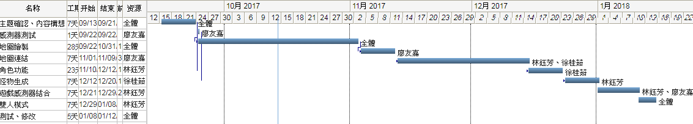

# 第四組
## 指導老師 
#### 黃文楨 系主任
## 題目  
#### 體感小遊戲
## 組員  
#### 0424008林鈺芳
#### 0424024徐桂茹
#### 0424056廖友嘉
## 內容
#### 利用UNITY軟體以及KINECT感測器施作出遊戲，透過地圖連接使玩家能遊玩數個關卡，且角色能使用各式各樣的能力，能力分別如下：
#### 1.飛行 2.躲避物品 3.打怪 4.抓取物品 
## 效益
#### 透過遊戲放鬆身心，提升反應能力、增進親友間的感情
## 限制
### 開發：開發者尚未接觸相關技術
### 使用者：器材限制
## 可行性分析
#### 1應用程式熟悉度：中高
#### 2.技術的熟系度：低
#### 3.規模：小
#### 4.相容性：低
## 功能性需求
### 1.感測器測試
### 2.地圖繪製(含寶藏及NPC)
### 3.地圖連結
### 4.角色功能
### 5.怪物生成
### 6.遊戲、感測器結合
### 7.雙人模式
## 非功能性需求
### 1.即時感測
### 2.系統相容
### 3.資料確保正確
## 甘特圖

